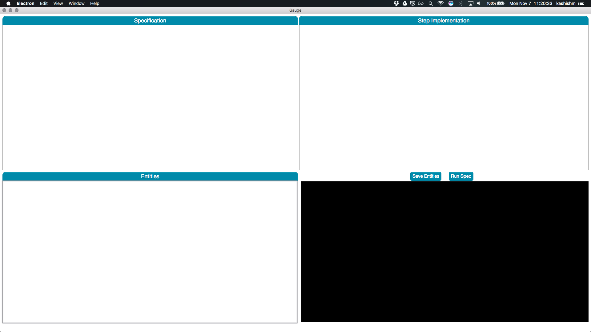
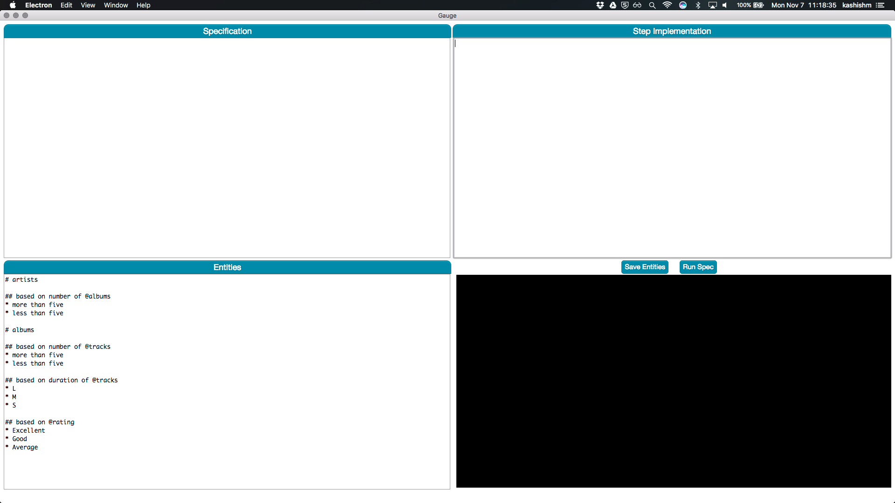
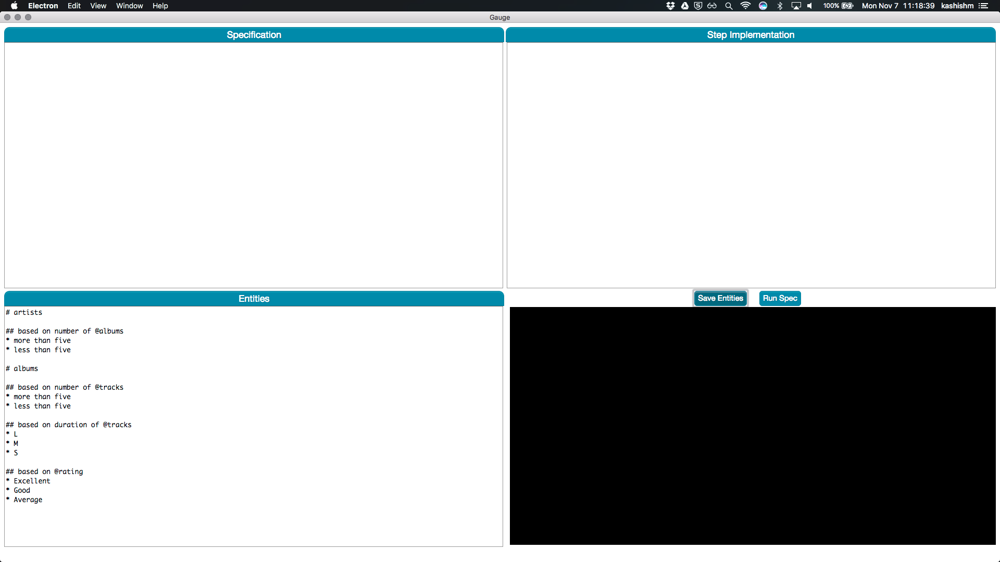
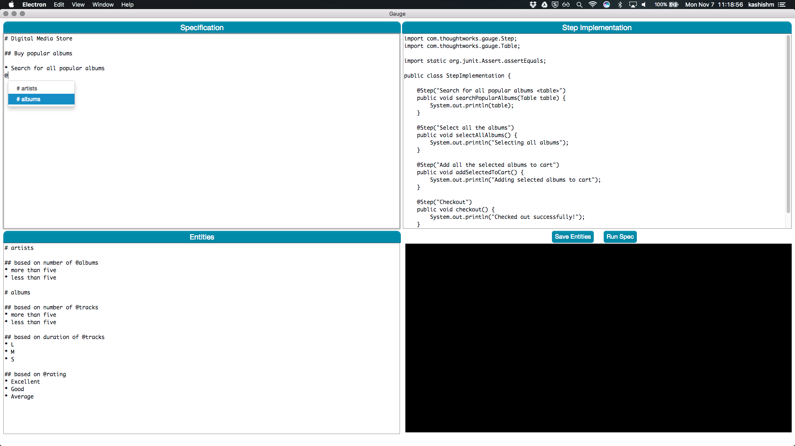
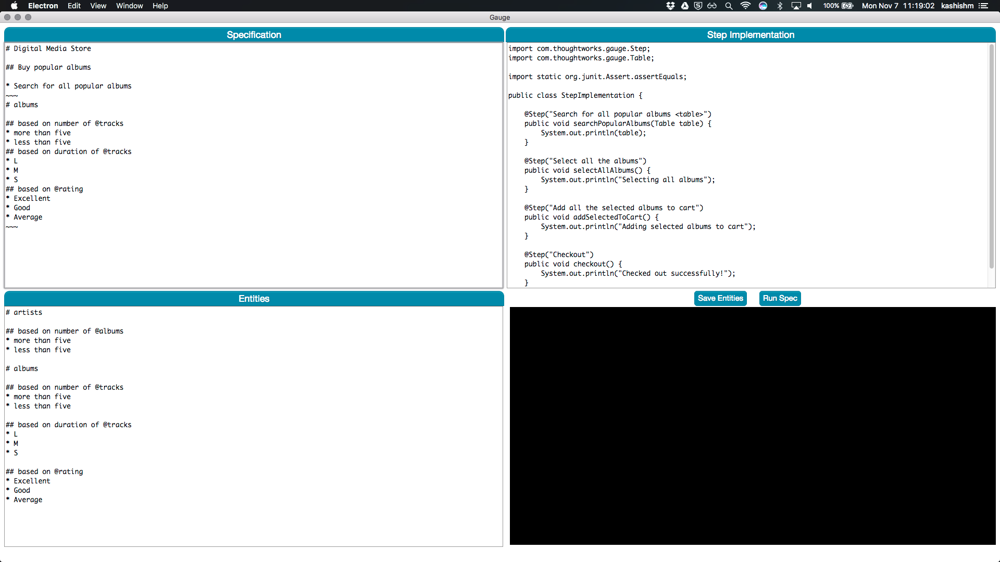
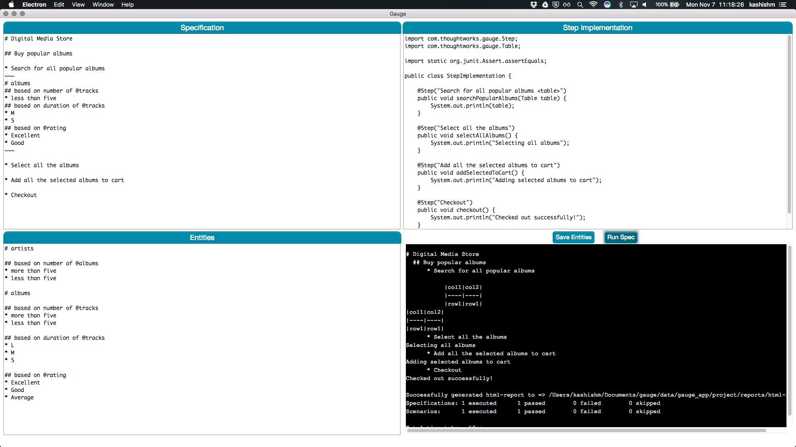

Test Data Spike
===============

[](code_of_conduct.md)

Status: WIP

Running the app
---------------

```
npm install
npm start
```

* This is a sample app where Gauge specs can be run. It comprises of
	- `Specification` section where the spec is defined.
	- `Step Implementation` section where implementations for given specs are written. Currently, it supports only Java.
	- `Entities` section defines various entities and test data partitions within them.
These sections will have predefined content for ease.



* Add the test elements to the corresponding section along with its partitions. The sample partition is present in `sample/partition` file.



* Save the entities using the button `Save Entities`.



* Write the spec and use `@` symbol to get autocomplete for test elements in params.



* Autocomplete will add the entire test element definition from sample/partition file. User can remove/customize the partitions based on use-case.



* The sample partition, spec, step implementation files are present in `sample` folder.


* Run the given specs and results can be seen on last section. Currently, It replaces the entity text from spec file with the following table

   |col1|col2|
   |----|----|
   |row1|row1|

In the final state, it is supposed to transform the partitions into test data that can be used by Gauge step.


